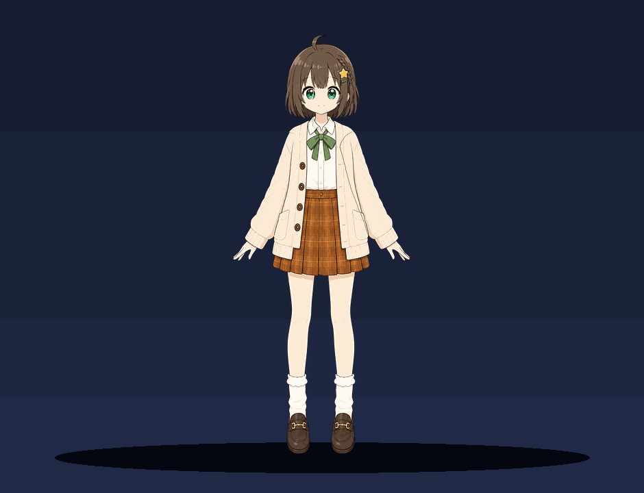
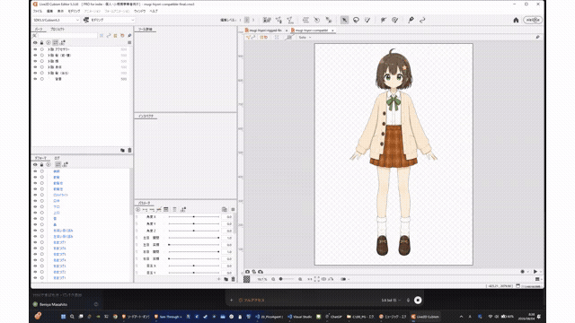

# むぎ Live2D / VRM モデル

## VRM プレビュー

Photoshopの「ディテールを保持 2.0」で高解像度化した同一Tポーズ原画だけを17枚の透過カードへ
決定的に分割した VRM 1.0 です。目、まつ毛、虹彩、口、頭、胴体、腕、肩下地、脚を個別メッシュにし、
呼吸・視線・まばたき・口パク・感情表現を再生します。腕の背面には原画由来の丸い肩下地を置き、
腕を下げても胴体との穴や角張った継ぎ目が見えにくい構造にしています。旧モデルの画像パーツは再利用していません。
画像をクリックすると高品質MP4を開けます。VRM本体は [`mugi.vrm`](exports/vrm/mugi.vrm) です。
仕様、利用条件、再生成・検証方法は [VRM 制作資料](docs/VRM.md)を参照してください。

最終構造と動画リンクの検査結果は[VRM品質レポート](docs/VRM_QUALITY_REPORT.md)にまとめています。

## Live2D 動作プレビュー

SDK 5モデルを直接描画したキャラクター単体のプレビューです。視線・顔向き、まばたき、口の開閉、髪揺れを自動再生します。画像をクリックするとMP4版を開けます。

HTMLベースのローカル動作確認ツールは `viewer/README.md` を参照してください。SDK 5/4の読込、上半身表示、視線追従、まばたき、口パク、髪揺れをブラウザで確認できます。

むぎ専用のモデル制作・書き出し管理ディレクトリです。

- `source/`: 権利を持つ元画像
- `work/psd/`: パーツ分割PSD
- `work/cubism/`: Cubism編集ファイル
- `exports/sdk5/`: Cubism SDK 5向け書き出し
- `exports/sdk4/`: Cubism SDK 4互換向け書き出し
- `exports/vrm/`: VRM 1.0 書き出し
- `reference/`: テンプレートや確認画像（再配布条件を確認して使用）

自動生成処理の実装は `C:\00_PG\30_live` に残し、完成モデルと制作素材だけをここで管理します。

Live2D 制作手順の正本は `WORKFLOW.md`、VRM 制作手順は `docs/VRM.md`、現在の進捗は
`STATUS.md` です。工程変更時は該当する手順書と進捗を同じ Git 変更内で更新します。
別キャラクターを新規作成するときは `NEW_CHARACTER.md` を使います。

再現可能なモデル生成は、固定済みの高品質リグへ同一トポロジーの画像を適用する[A方式](docs/FIXED_TOPOLOGY_PIPELINE.md)を優先します。入力画像はCubismへ入れる前に境界QAを通します。

隠れた額・後髪・口内をPhotoshopの生成塗りつぶしで補完するときは、原PSDを開かず[レイヤーsandbox方式](docs/LAYER_SANDBOX.md)を使います。

ひよりのリグの変形をむぎのArtMeshへ移すときは、頂点座標をコピーせず[キーフォーム転送方式](docs/KEYFORM_TRANSFER.md)で変位として転送します。
